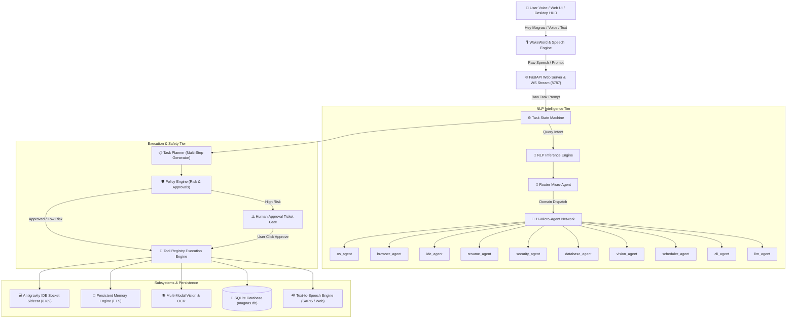

# 🏗️ MAGNAS AI — System Architecture & Design Specification

This document details the software architecture, component relationships, 11-Micro-Agent classifier network, multi-step planning engine, and data persistence models of **Magnas AI**.

---

## 📐 System Architecture Diagram



---

## 🤖 11-Micro-Agent Network Matrix

| Micro-Agent | Classifier Scope | Target Tool Actions & Capabilities |
| :--- | :--- | :--- |
| **Router Agent** | `router_agent` | Evaluates prompt domain in < 5ms and dispatches to specialized micro-agents. |
| **OS Agent** | `os_agent` | Window management, power actions, volume control, app launching/closing. |
| **Browser Agent** | `browser_agent` | Web search, reading online documentation, automated platform login. |
| **IDE Agent** | `ide_agent` | Deep Antigravity IDE project automation (`/goal`, `/plan`, `agy` execution). |
| **Resume Agent** | `resume_agent` | Local resume file search, LinkedIn profile gathering, formatted `.docx` generation. |
| **Security Agent** | `security_agent` | Inspect audit logs, check system permissions, revoke high-risk permits. |
| **Database Agent** | `database_agent` | Database queries, data exports, table backups. |
| **Vision Agent** | `vision_agent` | Screen OCR text extraction, image analysis, coordinate visual clicking. |
| **Scheduler Agent** | `scheduler_agent` | One-shot timers, daily cron schedule registration, task cancellations. |
| **CLI Agent** | `cli_agent` | PowerShell execution, package manager operations, network diagnostics. |
| **LLM Agent** | `llm_agent` | Conversational voice chat greetings, out-loud progress reporting, fallback LLM routing. |

---

## 🔄 5-Phase Task Lifecycle

```
[RECEIVED] ➔ [UNDERSTOOD] ➔ [PLANNED] ➔ [POLICY_CHECK] ➔ [EXECUTING] ➔ [VERIFYING] ➔ [COMPLETED]
                                               │
                                       (If High Risk)
                                               ▼
                                      [WAITING_APPROVAL] ➔ [APPROVED] ➔ [EXECUTING]
```

1. **`RECEIVED`**: Prompt received via Voice, Web API, or Desktop HUD.
2. **`UNDERSTOOD`**: NLP Inference Engine parses intent, confidence score, and entities; tags `agent_name`.
3. **`PLANNED`**: Task Planner decomposes request into an ordered sequence of `PlanStep` objects.
4. **`POLICY_CHECK`**: Policy Engine assesses highest risk level. High-risk tasks generate an `ApprovalTicket`.
5. **`EXECUTING`**: Tools execute sequentially; live step progress is streamed via WebSockets (`task_step_progress`). Audit log entries are saved.
6. **`VERIFYING`**: Output verification stage (`verify_task_output`) verifies file existence, size, build success, or search outputs.
7. **`COMPLETED`**: Final status recorded; spoken TTS notification issued.

---

## 💾 SQLite Database Schema (`magnas.db`)

- **`tasks`**: Task ID, raw prompt, intent, confidence, status, step details, risk level, output data, timestamps.
- **`approval_tickets`**: Ticket ID, task ID, action type, target summary, risk level, reason, status (`PENDING`/`APPROVED`/`REJECTED`).
- **`audit_logs`**: Log ID, task ID, action name, resource service (`ANTIGRAVITY_IDE_AGENT`, `BROWSER_NETWORK_SERVICE`, `LOCAL_FILESYSTEM_STORAGE`, etc.), permission used, risk level, details, timestamp.
- **`events`**: Event ID, type, payload JSON, timestamp.
- **`memory_store`**: Key, value, category, updated timestamp.
- **`cron_jobs`**: Job ID, name, prompt, interval in minutes, status, last run, next run timestamps.
